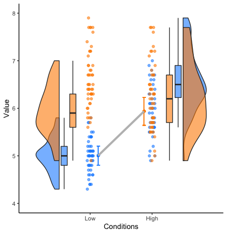
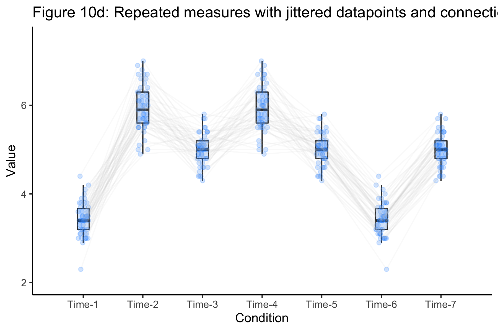
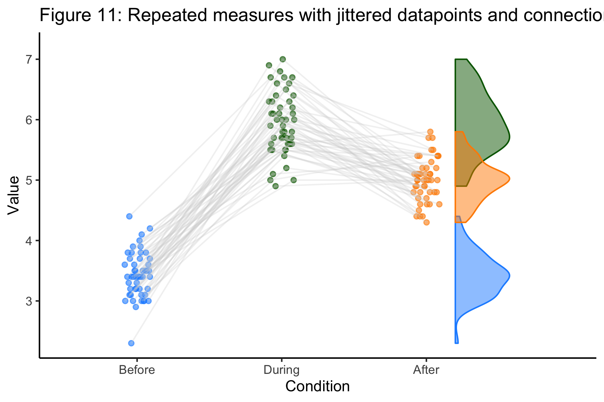

[](https://doi.org/10.5281/zenodo.3715576)
[](https://mybinder.org/v2/gh/jorvlan/open-visualizations/master)
# open-visualizations
```
van Langen, J. (2020). Open-visualizations in R and Python. 
https://github.com/jorvlan/open-visualizations
```

This repository has been cited by:
``` 
- Genc, S., et al., (2020). Longitudinal white matter development in child-ren is associated with puberty, attentional difficulties and mental health. 
bioRxiv, 607671. https://www.biorxiv.org/content/10.1101/607671v2
- Wynn J., et al., (2020). Encoding and retreival eye movements mediateage differences in pattern completion. 
PsyArXiv. https://psyarxiv.com/mdx3f/
- Ehlers, M., et al., (2020). Natural variations in brain morphology do not account for inter-individual differences in defensive responding during fear acquisition training and extinction. PsyArXiv. https://psyarxiv.com/q2kyf/
- Uhlig, M., & Gaebler, M. (2020, July 27). Rapid brain changes following acute psychosocial stress. Retrieved from osf.io/vw2zb
- Bejjani, C., & Egner, T. (2020). How reinforcement shapes the binding of stimulus-control associations. 
PsyArXiv. https://psyarxiv.com/cdpxh/
```

Visualizations based on best open science practices.
# Made in R






# Made in Python


This repository currently includes visualizations made with:
- Python (.ipynb)
- R (.rmd)

## Update 30 April - 2020: 
Thanks to the overwhelming feedback on Twitter, and thanks to Micah Allen, I will try to implement some comments and upload an updated version somewhere in the next two months. It might be that, due to the recent Rstudio update, some package versions don't work anymore e.g., gghalves. If you encounter this problem, please try to install those packages from CRAN and if that doesn't work, try to install it from the respective GitHub package page. 


# Interactive tutorials
Both Python tutorials and the R tutorial are directly available through Binder. Click on the Binder launcher to open them! 

NOTE: if you want to open the R tutorial with Binder and use RStudio, you'll have to select RStudio within the Jupyter environment by - inside the R folder - clicking: 'new' -> 'RStudio'. This will open RStudio in Binder. If you perform the R tutorial in Binder, the error:`Error in grid.newpage() : could not open file ...` occurs when using ggsave. At this stage, I don't know how to fix this issue, but the figure will be presented, so please ignore this error.

# Background
The idea behind the ‘open-visualizations’ repository stems from the fact that (open) science - in general - lacks ‘fully’ transparent and robust visualizations, i.e., figures have always some form of ‘hidden-data’. To overcome this issue, I created this repository. Some of the work in R is inspired by work from Allen et al. (2019)(https://github.com/RainCloudPlots/RainCloudPlots)

There is a zenodo (https://doi.org/10.5281/zenodo.3715576) archive of the code and this repository is made available under the MIT license i.e., you can do with it what you want, but if you use it, reference needs to be given to the author of this repository.
```
J. van Langen. (2020). Open-visualizations in R and Python. 
https://github.com/jorvlan/open-visualizations
```

I hope that these tutorials are helpful for your research and if you have any questions, suggestions for improvement - I'm nor R nor Python Pro - or identify bugs, please open an issue in this repository. 
