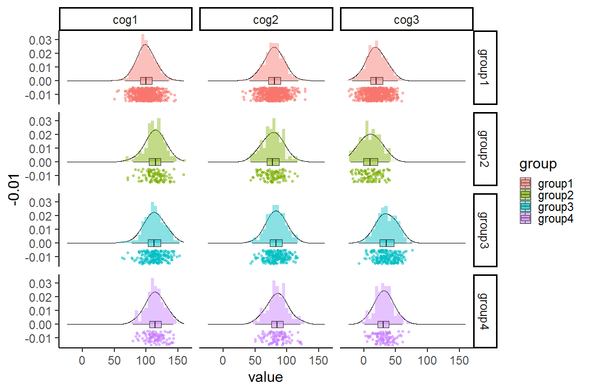
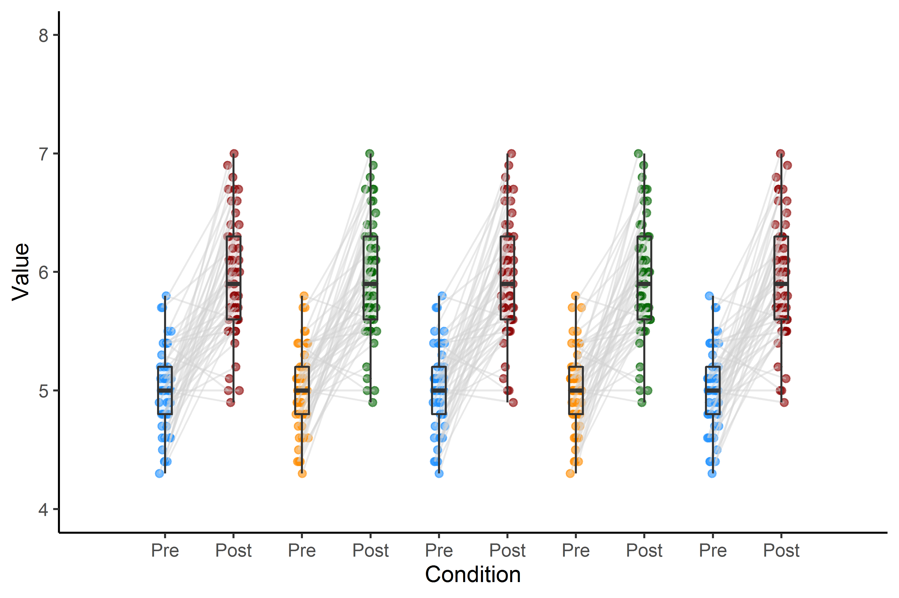
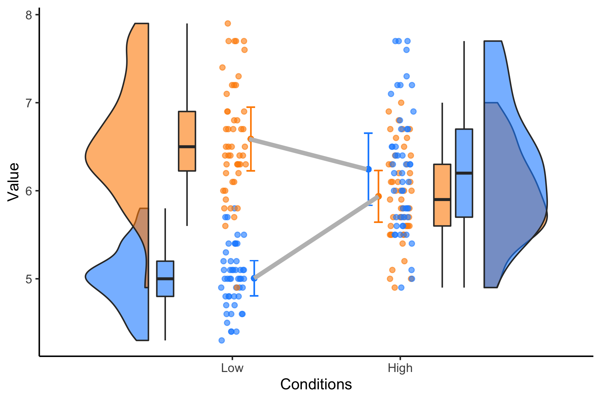
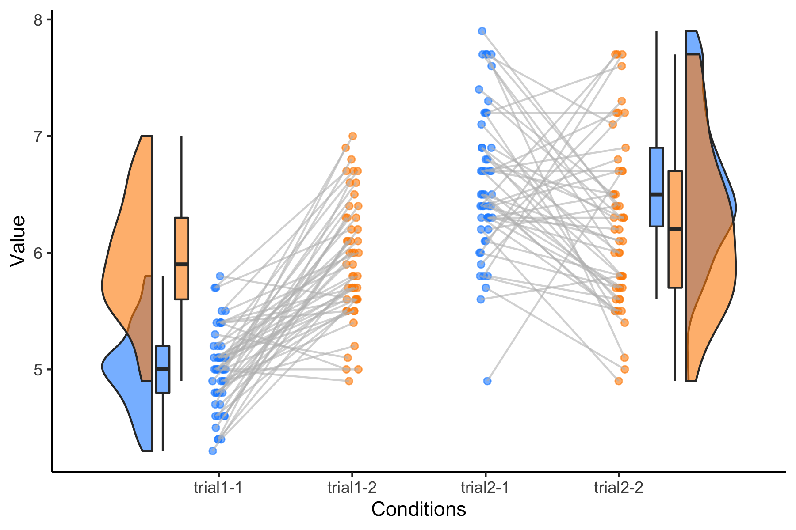
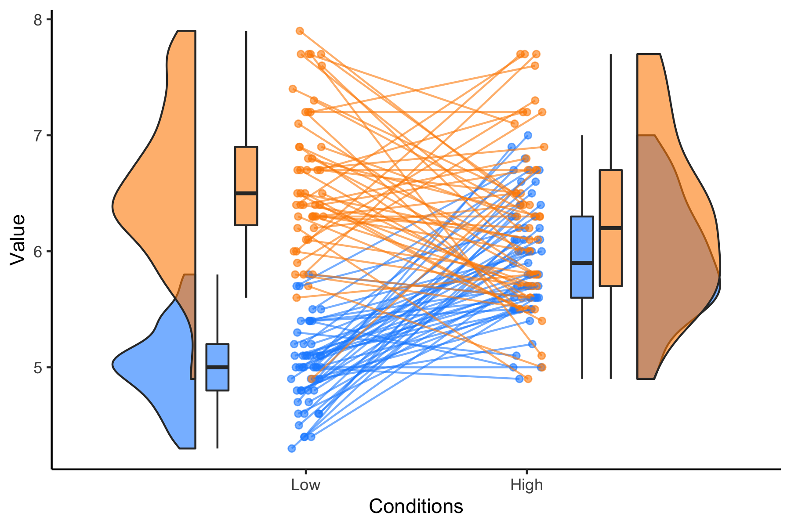
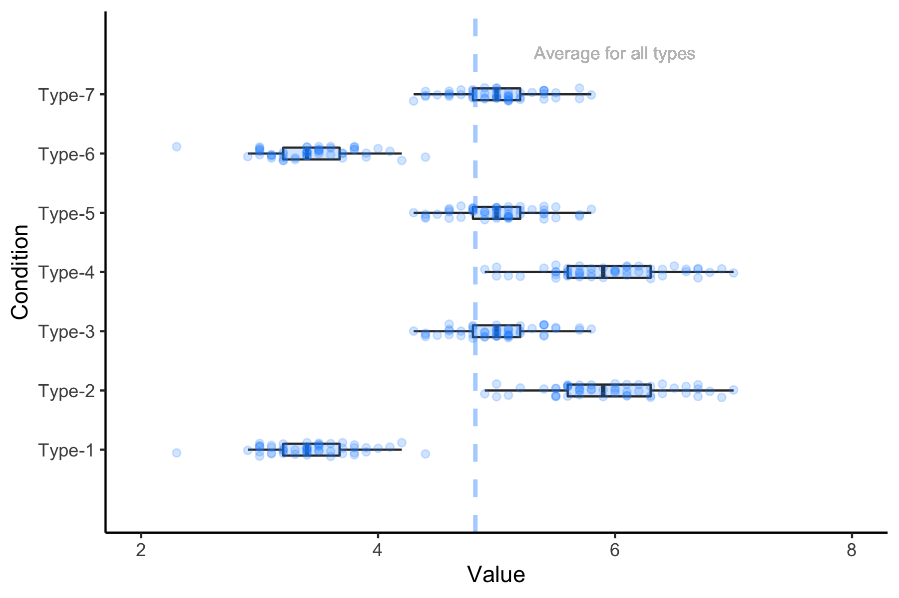

# open-visualizations

If you use this repository for your research, please cite it, thank you.

<pre>
- van Langen, J. (2020). Open-visualizations in R and Python. 
<a href="https://github.com/jorvlan/open-visualizations">https://github.com/jorvlan/open-visualizations</a>
</pre>

This repository has been used by:

### 2021
<pre>
- Pálffy, Z., et al., (2021). Cross-modal auditory priors drive 
    the perception of bistable visual stimuli with reliable differences between individuals. 
    <b>PsyArXiv</b>. <a href="https://psyarxiv.com/kj5cf/">https://psyarxiv.com/kj5cf/</a>
- Altay, S., et al., (2021). Information Delivered by a Chatbot 
    Has a Positive Impact on COVID-19 Vaccines Attitudes and Intentions.
    <b>PsyArXiv</b>. <a href="https://psyarxiv.com/eb2gt/">https://psyarxiv.com/eb2gt/</a>
</pre>

### 2020    
<pre>
- Petzka, M., et al., (2020). Does sleep-dependent consolidation favour weak memories?
    <b>Cortex</b>, 134, 65-75. <a href="https://doi.org/10.1016/j.cortex.2020.10.005">https://doi.org/10.1016/j.cortex.2020.10.005</a>
- Plotnine: A grammar of graphics for Python (2020). 
    <b>GitHub</b>. <a href="https://github.com/has2k1/plotnine">https://github.com/has2k1/plotnine</a>
    <b>readthedocs</b>. <a href="https://plotnine.readthedocs.io/en/stable/">https://plotnine.readthedocs.io/en/stable/</a>
- Daeglau, M., et al., (2020). Motor Imagery EEG neurofeedback skill acquisition 
    in the context of declarative interference and sleep. 
    <b>bioRxiv</b>. <a href="https://doi.org/10.1101/2020.12.11.420919">https://doi.org/10.1101/2020.12.11.420919</a> 
- Weiss, B., et al., (2020). 
    Examining Changes in Personality Following Shamanic Ceremonial Use of Ayahuasca.
    <b>Research Square</b>. <a href="https://www.researchsquare.com/article/rs-111130/v1">https://www.researchsquare.com/article/rs-111130/v1</a>
- Wiwad, D. et al., (2020).
    The impact of COVID-19 on attitudes toward poverty and inequality.
    <b>Journal of Experimental Social Psychology</b>. <a href="https://doi.org/10.1016/j.jesp.2020.104083">https://doi.org/10.1016/j.jesp.2020.104083</a>
- Wiwad, D., et al., (2020).
    Recognizing the Impact of Covid-19 on the Poor Alters Attitudes Towards Poverty and Inequality.
    <b>PsyArXiv</b>. <a href="https://psyarxiv.com/geyt4/">https://psyarxiv.com/geyt4/</a>
- Ehlers, M.R., et al., (2020). 
    Revisiting potential associations between brain morphology, 
    fear acquisition and extinction through new data and a literature review. 
    <b>Scientific Reports</b>. <a href="https://doi.org/10.1038/s41598-020-76683-1">https://doi.org/10.1038/s41598-020-76683-1</a>
- Bejjani, C., et al., (2020). 
    Minimal impact of consolidation on learned switch-readiness.
    <b>bioRxiv</b>. <a href="https://psyarxiv.com/5ewj6/">https://psyarxiv.com/5ewj6/</a>
- Mosley, P., et al., (2020). 
    A Randomised, Double-Blind, Sham-Controlled 
    Trial of Deep Brain Stimulation of the Bed Nucleus of the Stria Terminalis 
    for Treatment-Resistant Obsessive-Compulsive Disorder. 
    <b>medRxiv</b>. <a href="https://www.medrxiv.org/content/10.1101/2020.10.24.20218024v1">https://www.medrxiv.org/content/10.1101/2020.10.24.20218024v1</a>
- Kuhrt, D., et al., (2020). 
    An immersive first-person navigation task for abstract knowledge acquisition. 
    <b>bioRxiv</b>. <a href="https://www.biorxiv.org/content/10.1101/2020.07.17.208900v1">https://www.biorxiv.org/content/10.1101/2020.07.17.208900v1</a>
- Hatano, A., et al., (2020).
    Thinking about thinking: People Underestimate Intrinsically Motivating Experiences of Waiting
    <b>PsyArXiv</b>. <a href="https://psyarxiv.com/r6mde">https://psyarxiv.com/r6mde</a>
- Medel, V., et al., (2020). 
    Complexity and 1/f slope jointly reflect cortical states across different E/I balances. 
    <b>bioRxiv</b>. <a href="https://doi.org/10.1101/2020.09.15.298497">https://doi.org/10.1101/2020.09.15.298497</a>
- Genc, S., et al., (2020). 
    Longitudinal patterns of white matter fibre density and morphology in children 
    is associated with age and pubertal stage. 
    <b>Developmental Cognitive Neuroscience</b>, 100853. <a href="https://doi.org/10.1016/j.dcn.2020.100853">https://doi.org/10.1016/j.dcn.2020.100853</a>
- Mosley, P., et al.,(2020). 
    Subthalamic Deep Brain Stimulation Identifies Frontal Networks Supporting Initiation, 
    Inhibition and Strategy Use in Parkinson's Disease: Initiation and Inhibition after 
    STN-DBS for PD. 
    <b>NeuroImage</b>, 117352. <a href="https://doi.org/10.1016/j.neuroimage.2020.117352">https://doi.org/10.1016/j.neuroimage.2020.117352</a>
- Genc, S., et al., (2020). 
    Longitudinal white matter development in child-ren is associated with puberty, 
    attentional difficulties and mental health. 
    <b>bioRxiv</b>, 607671. <a href="https://www.biorxiv.org/content/10.1101/607671v2">https://www.biorxiv.org/content/10.1101/607671v2</a>
- Wynn J., et al., (2020). 
    Encoding and retreival eye movements mediateage differences in pattern completion. 
    <b>PsyArXiv</b>. <a href="https://psyarxiv.com/mdx3f/">https://psyarxiv.com/mdx3f/</a>
- Ehlers, M.R, et al., (2020). 
    Natural variations in brain morphology do not account for inter-individual 
    differences in defensive responding during fear acquisition training and extinction. 
    <b>PsyArXiv</b>. <a href="https://psyarxiv.com/q2kyf/">https://psyarxiv.com/q2kyf/</a>
- Uhlig, M., & Gaebler, M. (2020, July 27). 
    Rapid brain changes following acute psychosocial stress. 
    <b>OSF</b> <a href="https://osf.io/vw2zb/">https://osf.io/vw2zb/</a>
- Bejjani, C., & Egner, T. (2020). 
    How reinforcement shapes the binding of stimulus-control associations. 
    <b>PsyArXiv</b>. <a href="https://psyarxiv.com/cdpxh/">https://psyarxiv.com/cdpxh/</a>
- Wiedemann (2020). 
    lcsm: Univariate and Bivariate Latent Change Score Modeling.
    <b>CRAN</b> <a href="https://cran.r-project.org/web/packages/lcsm/vignettes/v0-longitudinal-plots.html">https://cran.r-project.org/web/packages/lcsm/vignettes/v0-longitudinal-plots.html</a>
</pre> 

Visualizations based on best open science practices.
# Made in R

# Made in R (credit to R. Kievit).

# Made in R

## Taken from the R package development version

## Taken from the R package development version

## Taken from the R package development version

## Taken from the R package development version

# Made in Python

This repository currently includes visualizations made with:
- Python (.ipynb)
- R (.rmd)

## Update 15 January 2021: 

Now there is a fully functional R-package ['raincloudplots'](https://github.com/jorvlan/raincloudplots) to make it even easier to create these visualizations for your research.
The package has been incorporated in the following paper (in press):
<pre>
- Allen, M., Poggiali, D., Whitaker, K., Marshall, T. R., <b>van Langen, J.</b>, & Kievit, R. A. (2021). 
    Raincloud plots: a multi-platform tool for robust data visualization. 
    <b>Wellcome open research</b>. <a href="https://wellcomeopenresearch.org/articles/4-63/v2">https://wellcomeopenresearch.org/articles/4-63/v2/</a>
</pre>

## Update 10 Augustus 2020:
Development of a R package has started and a first version is expected to be completed by September 2020.

## Update 30 April - 2020: 
Thanks to the overwhelming feedback on Twitter, and thanks to Micah Allen, I will try to implement some comments and upload an updated version somewhere in the next two months. It might be that, due to the recent Rstudio update, some package versions don't work anymore e.g., gghalves. If you encounter this problem, please try to install those packages from CRAN and if that doesn't work, try to install it from the respective GitHub package page. 

# Interactive tutorials
Both Python tutorials and the R tutorial are directly available through Binder. Click on the Binder launcher to open them! 

NOTE: if you want to open the R tutorial with Binder and use RStudio, you'll have to select RStudio within the Jupyter environment by - inside the R folder - clicking: 'new' -> 'RStudio'. This will open RStudio in Binder. If you perform the R tutorial in Binder, the error:`Error in grid.newpage() : could not open file ...` occurs when using ggsave. At this stage, I don't know how to fix this issue, but the figure will be presented, so please ignore this error.

# Background
The idea behind the ‘open-visualizations’ repository stems from the fact that (open) science - in general - lacks ‘fully’ transparent and robust visualizations, i.e., figures have always some form of ‘hidden-data’. To overcome this issue, I created this repository. Some of the work in R is inspired by work from Allen et al. (2019)(https://github.com/RainCloudPlots/RainCloudPlots)

There is a zenodo (https://doi.org/10.5281/zenodo.3715576) archive of the code and this repository is made available under the MIT license i.e., you can do with it what you want, but if you use it, reference needs to be given to the author of this repository.

<pre>
van Langen, J. (2020). Open-visualizations in R and Python. 
<a href="https://github.com/jorvlan/open-visualizations">https://github.com/jorvlan/open-visualizations</a>
</pre>

I hope that these tutorials are helpful for your research and if you have any questions, suggestions for improvement or identify bugs, please open an issue in this repository. 
